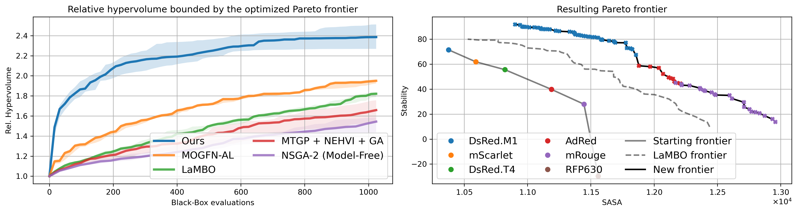

# Probabilistic Generative Models for Automatic Guided Drug Discovery

This repository contains the PhD thesis *"Probabilistic Generative Models for Automatic Guided Drug Discovery"* by Yevgen Zainchkovskyy, along with a data dump of results in CSV format. The thesis was completed at the Technical University of Denmark (DTU) in collaboration with Novo Nordisk A/S.

## Overview

This work explores the intersection of machine learning and computational drug discovery. The primary focus is on probabilistic generative models, specifically:
- **Distance aligning in latent spaces of Variational Autoencoders (VAEs)**.
- A **comprehensive framework for guided drug discovery**, integrating Bayesian optimization.

The thesis demonstrates advancements in protein-based drug design and proposes novel methodologies for generative modeling and optimization. Key contributions include methods to optimize latent representations for drug discovery tasks and experiments validating these models.

## Repository Contents

- **Thesis Document**: `thesis.pdf` - Full PhD thesis in PDF format.
- **Data**: `results.csv` - main results in CSV format.

## Key Contributions

1. **Bayesian Optimization**: Improved methods for lead optimization in drug discovery.
2. **Latent Space Alignment**: Enhanced generative models by aligning latent space distances with target properties.
3. **Novel Protein Design Framework**: Leveraging state-of-the-art protein language models for drug discovery.

## Main results
We applied our optimization framework to enhance the design of red fluorescent proteins (RFPs). The results of this optimization are summarized in the plots below:  

1. **Relative Hypervolume Improvement**: This plot tracks the progress of our optimization process across iterations, showing how effectively the method identifies solutions that improve across multiple objectives. 

2. **Pareto Front**: This plot visualizes the final set of optimized RFP designs. Each point represents a unique protein variant, with no further improvement possible in one objective without sacrificing another. The Pareto front showcases the balance achieved between conflicting objectives (stability and solvent accessible surface area), highlighting the effectiveness of our approach in discovering high-quality RFP variants.  



## Citation

If you find this repository useful in your research, please cite as:
```
TBA (please check back later - waiting for DOI)
```

## Acknowledgements

This work was completed under the supervision of:
- Prof. Søren Hauberg, DTU Compute
- Carsten Stahlhut, Novo Nordisk
- Jesper Ferkinghoff-Borg, Novo Nordisk
- Kilian W. Conde-Frieboes, Novo Nordisk

Special thanks to collaborators, colleagues at DTU Compute and Novo Nordisk, and to my family for their unwavering support.

## Contact

For questions or collaboration inquiries, feel free to contact:
- **Author**: Yevgen Zainchkovskyy
- **Email**: [eugene@3bytesahead.com](mailto:eugene@3bytesahead.com)

---
